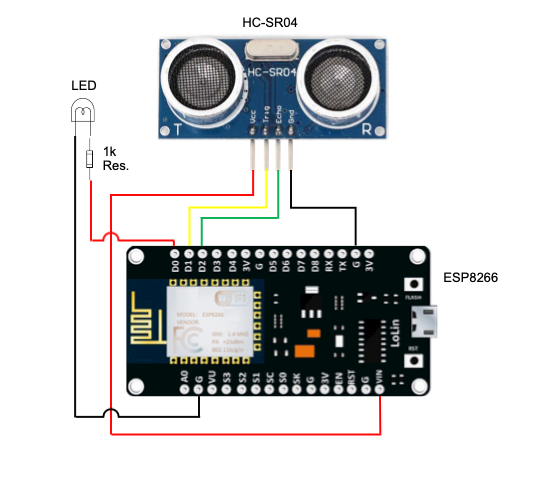

# HC-SR04 Sensor Alarm

***Distance detection system made with HC-SR04 Ultrasonic Sensor and micro-controller ESP8266.<br />***
- Circuit controlled by Wi-Fi with the Blynk app/website.<br />
- Trigger distances are customizable in centimeters (cm).<br />
- Delay times are customizable in milliseconds (ms).<br />

Still in progress...

---

A special thanks to the ***ESP8266 Community*** for the board driver for the ESP8266 in Arduino IDE and also to ***Volodymyr Shymanskyy*** for the Blynk library used in this project for Wi-Fi connectivity.

---

## Installation

You can use multiple IDEs, such as Arduino IDE (Genuino), to transfer the code to the microcontroller ESP8266.<br />
There are also plugins to use in IDEs like VSCode, Sublime-text, etc.<br />

After compiling the .ino main file the code can be sent to the ESP and the installation/programming phases are over.

---

## Components

- 1x - ESP8266 <br/>
- 1x - HC-SR04 <br/>
- 1x - LED* <br/>
- 1x - 1k Resistor* <br/>
- 4x or 6x(*) - Jumper Wires <br/>

(*) Optional - Can be replaced with other components.

---

### Circuit Sketch

<p align="center">
  
</p>

---

### Issues & Solutions

***a) Port closed or access denied in the USB connection.***<br />

a.1) There's a shell file "ttyUSB0.sh", located in the "src" dir made to open the USB0 port to enable the ESP connection, fixing issue ***a)***.<br />

That executes the following command:

```bash
sudo chmod -R 777 /dev/ttyUSB0 
  ```
  
To run simply type:

```bash
./src/ttyUSB0.sh
```

Feel free to modify it to your respective port.

---

***Or:***

a.2) You can run the following commands:

```bash
groups
```

To see all available groups type:

```bash
compgen -g
```

Most of them are self-explanatory, in this case, you want to add yourself to either the tty group or dial-out, which you would do by:

```bash
sudo usermod -a -G tty <USERNAME>
```

Then you should have access to tty without the use of sudo.

---

### TODO

- [x] Sketch
- [ ] Config file
- [ ] Blynk LED
- [ ] Blynk screenshot
